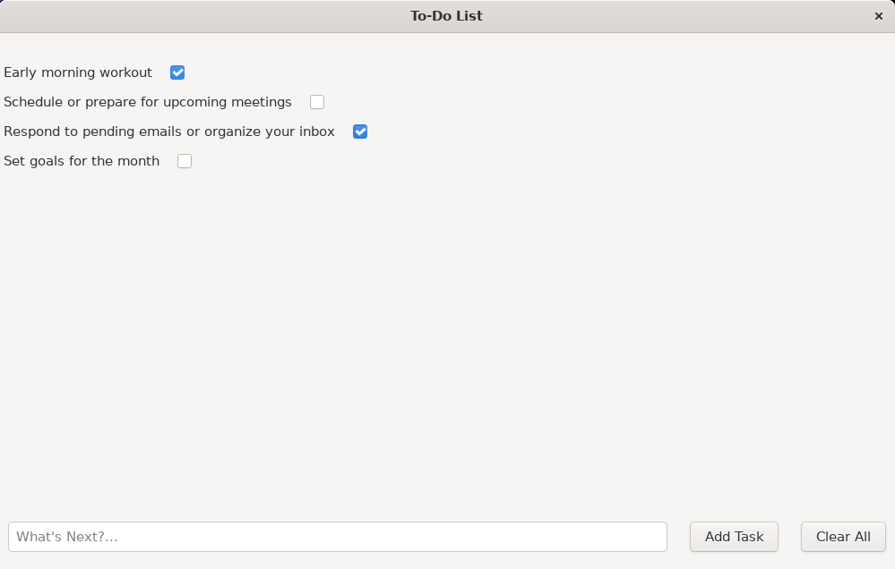

# To-Do List App GUI

A minimalist and functional To-Do List application built with **C** and **GTK 3**, designed to help users manage tasks with a clean and interactive GUI.

---

## Features
- **Add Tasks:** Input new tasks using a text field and add them to the to-do list with a single button click.
- **Display Tasks:** View tasks dynamically as they are added to the list.
- **Mark Completion:** Each task includes a checkbox for marking it as done.
- **Clear All Tasks:** A button to clear the entire list of tasks efficiently.
- **Dynamic Updates:** Tasks are updated and displayed in real-time.

---

## Installation

1. **Clone the Repository**:
    ```bash
    git clone https://github.com/SCCSMARTCODE/GTK-GUI-Learning
    cd todo-app
    ```

2. **Install Dependencies**:
    Ensure you have GTK 3 installed:
    ```bash
    sudo apt update
    sudo apt install libgtk-3-dev
    ```

3. **Build the Application**:
    Compile the code using `gcc`:
    ```bash
    gcc -Wall -Wextra -o todo todo.c utils.c `pkg-config --cflags --libs gtk+-3.0`
    ```

4. **Run the Application**:
    ```bash
    ./todo
    ```

---

## Usage
1. Launch the app using the steps above.
2. Add a task by typing into the input field and clicking **"Add Task"**.
3. Mark tasks as complete using the checkboxes.
4. Clear the list at any time with the **"Clear All"** button.

---

## Screenshot
  

---

## Technologies Used
- **Language:** C
- **Framework:** GTK 3

---

## Contributing
Contributions are welcome! Fork the repository and submit a pull request for enhancements or bug fixes.

---

## License
This project is licensed under the MIT License. See the `LICENSE` file for more details.

---

## Author
- **SCCSMARTCODE**
